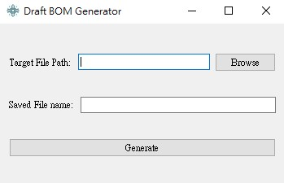

# Draft BOM Generator

## Overview
This Draft BOM Generator is a small program for generating and managing Bills of Materials (BOM) in electronics manufacturing.

  <!-- Replace with the actual path to the logo in your repository -->

## Configuration
Edit `config.json` to set API keys and other configurations.

## Features
- **BOM Generation**: Automatically generate BOMs from various input formats.
- **Part Search**: Integrated search functionality to find and add electronic components.
- **Data Normalization**: Standardize BOM data from multiple sources.
- **Excel Integration**: Directly read and write Excel files for easy data manipulation.

## Usage
1. **Select File**: Use the 'Browse' button to select the input BOM file.
2. **Set Save Name**: Enter a name for the generated BOM file.
3. **Start Process**: Click the 'Search' button to initiate the BOM generation process.
4. **Monitor Progress**: View the progress in the separate progress dialog window.
5. **Access Output**: Upon completion, the generated BOM will be saved in the specified location.

## Dependencies
- Python 3.9
- PyQt5
- Pandas
- Requests
- Numpy
- Tqdm
